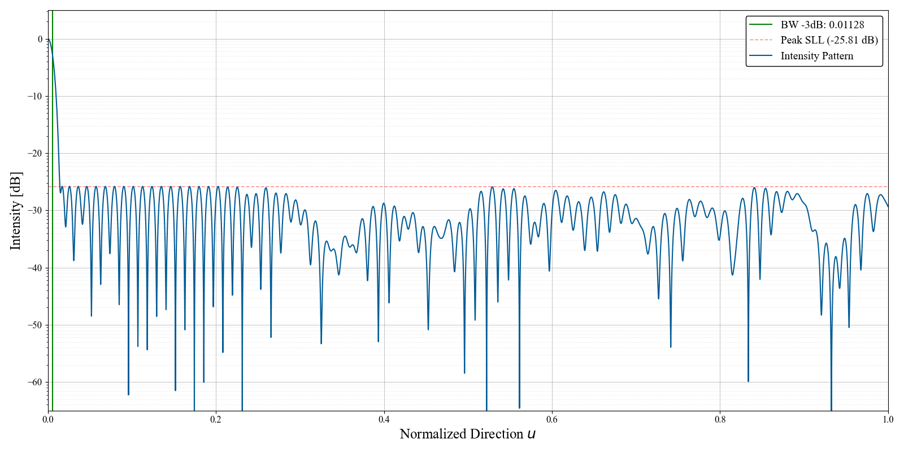

# High-Precision Sparse Array Synthesis

This repository provides the numerical results and optimization engine for the synthesis of equiamplitude sparse linear arrays (SLA). The framework utilizes analytical gradient descent to minimize the Peak Sidelobe Level (PSLL).

## Repository Structure

### 1. /results
Numerical data for benchmark and large-scale cases (N = 78 to 3000).
*   **`/coordinates`**: Optimized element positions in `.txt` format. Each file contains a comma-separated list of normalized coordinates $x \in [0, 1]$. These files are provided for independent verification in third-party electromagnetic simulation software and **`visualizer.py`**: A standalone script to reproduce radiation patterns and calculate PSLL values directly from the coordinate files.
*   **`/plots`**: High-resolution radiation patterns (PDF and PNG) for each reported case, demonstrating the achieved equiripple state.
* **`/saturation_data`**: Four datasets containing PSLL values and optimized element positions(boundary points 0 and 1 are excluded) for different array average element spacing ($\rho = \{0.75, 1.0, 1.5, 2.0\}$) at a fixed main lobe width ($2/\nu$), optimization zone $u \in [1/\nu, 1]$. This data illustrates the physical saturation floor of the aperture.
### 2. /article_figures
Figures and diagrams used in the paper.

### 3. /src
*   **`optimizer.py`**: A Python script that executes the optimization process. By default, it runs a single iteration, displays the resulting beam pattern plot, and saves the element positions to a file named `coordinates_{N}_{K}.txt` in the root directory.

To install the required libraries, run:
```bash
pip install -r requirements.txt
```

The `optimizer.py` script is designed for full reproducibility. 
Specific settings such as initial step size, etc. are provided as comments within the source code for each specific case.
To start the synthesis: `python optimizer.py`

To start the synthesis: 
```bash
python optimizer.py
```

# **Example Case:** N=132, Aperture $L=90.5\lambda$, PSLL $\approx$ -25.8 dB.




## License
Distributed under the **GNU General Public License v3 (GPLv3)**.
